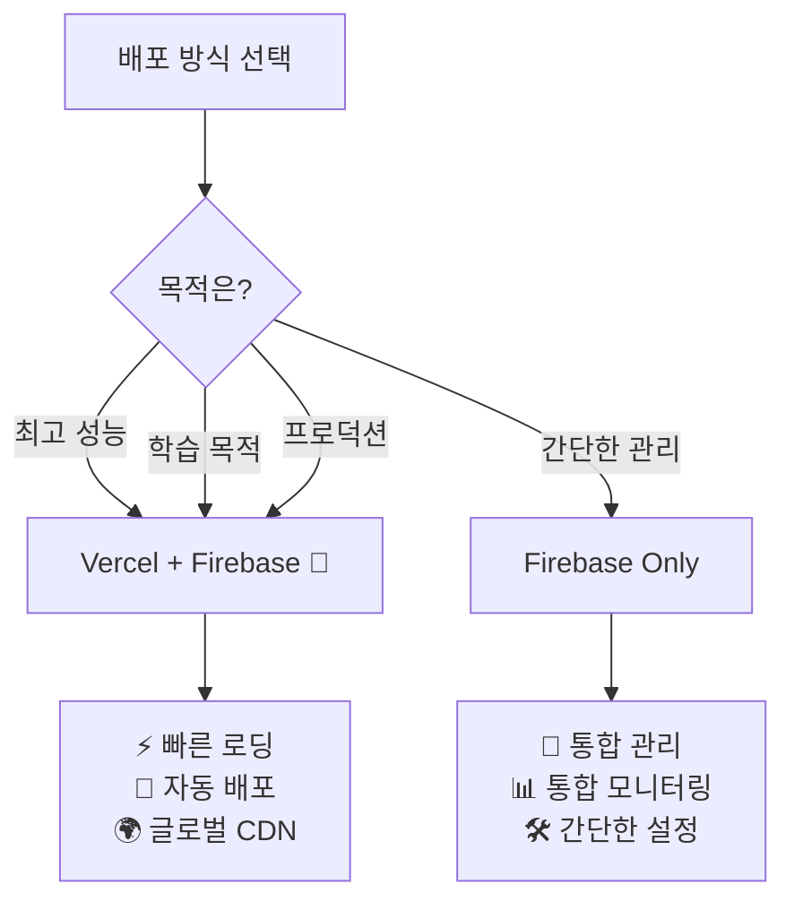
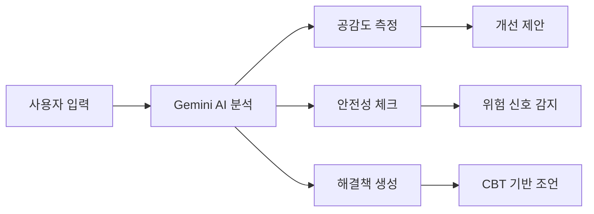
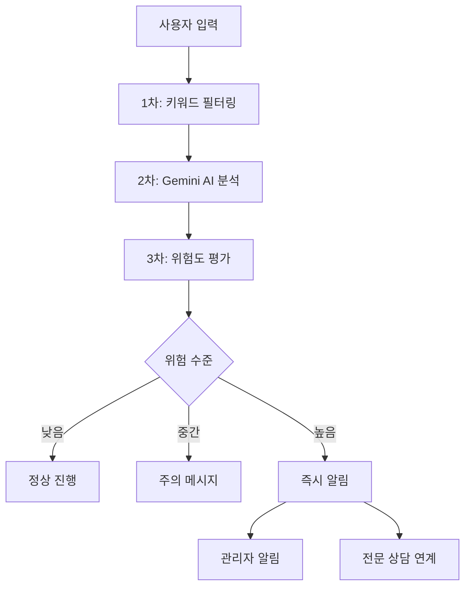

<div align="center">

# 🌈 ABC 친구 도우미

### *AI 기반 또래 상담 교육 플랫폼*

초등학생이 공감, 경청, 문제해결 능력을 게임처럼 재미있게 배우는 혁신적인 교육 도구

[](https://opensource.org/licenses/MIT)
[](https://firebase.google.com/)
[](https://vercel.com)
[](https://reactjs.org/)
[](https://ai.google.dev/)
[](https://tailwindcss.com/)

[🚀 라이브 데모](#) • [📖 문서](VERCEL_DEPLOYMENT.md) • [🐛 버그 신고](https://github.com/plusiam/abc-friend-helper/issues) • [💡 기능 제안](https://github.com/plusiam/abc-friend-helper/discussions)

</div>

---

## 🎯 프로젝트 소개

**ABC 친구 도우미**는 Google Gemini AI를 활용하여 초등학생들이 또래 상담 기술을 체계적으로 학습할 수 있는 교육 플랫폼입니다. 

### 🌟 핵심 가치
- **🧠 정서지능 향상**: AI 기반 공감 능력 트레이닝
- **🎮 게이미피케이션**: 재미있는 학습 경험 제공
- **🛡️ 안전 우선**: 아동 보호 정책 완벽 준수
- **📚 교육적 효과**: 체계적인 상담 기법 학습

---

## ✨ 주요 특징

<table>
<tr>
<td width="50%">

### 🎯 **4단계 상담 프로세스**
체계적인 상담 교육으로 단계별 성장
- **1단계**: 감정 인식 및 이해
- **2단계**: 공감 표현 연습
- **3단계**: 해결책 탐색
- **4단계**: 격려 및 지지

</td>
<td width="50%">

### 🤖 **Gemini AI 통합**
안전하고 교육적인 AI 피드백 시스템
- 실시간 공감 표현 분석
- 연령별 맞춤 언어 사용
- 위험 신호 자동 감지
- CBT 기반 해결책 제안

</td>
</tr>
<tr>
<td width="50%">

### 🎮 **게이미피케이션**
동기부여를 높이는 게임 요소
- 스킬 포인트 시스템
- 업적 배지 수집
- 레벨업 시스템
- 일일 상담 팁

</td>
<td width="50%">

### 🛡️ **안전 보호 시스템**
포괄적인 아동 안전 장치
- 실시간 위험 신호 감지
- 자동 관리자 알림
- 전문 상담 자원 연계
- COPPA 준수

</td>
</tr>
</table>

---

## 🚀 배포 옵션

<div align="center">

### 🌟 **추천: Vercel + Firebase**
*최고의 성능과 개발 경험*

| 특징 | Vercel + Firebase | Firebase Only |
|------|:----------------:|:-------------:|
| **성능** | ⚡ 글로벌 CDN | 🔥 Firebase CDN |
| **배포** | 🔄 Git 자동배포 | 📝 CLI 수동배포 |
| **프리뷰** | 🌍 브랜치별 프리뷰 | ❌ 지원안함 |
| **비용** | 💰 무료 시작 | 💰 무료 시작 |
| **학습 가치** | 🎓 최신 기술 스택 | 🎓 통합 플랫폼 |

</div>

### 🎯 배포 옵션 선택 가이드



---

## 🛠️ 기술 스택

<div align="center">

### Frontend


### Backend & AI


### DevOps & Deployment


</div>

---

## 🚀 빠른 시작

### 📋 사전 요구사항

<details>
<summary>🔧 필수 도구 및 계정</summary>

**필수 도구:**
- Node.js 18.0 이상
- npm 또는 yarn
- Git
- Firebase CLI (`npm install -g firebase-tools`)
- Vercel CLI (`npm install -g vercel`) *Vercel 배포 시*

**필수 계정:**
- [Firebase 프로젝트](https://console.firebase.google.com)
- [Google Cloud](https://console.cloud.google.com) (Gemini API)
- [Vercel 계정](https://vercel.com) *Vercel 배포 시*

</details>

### 🌟 Option 1: Vercel + Firebase (추천)

<details>
<summary>💫 최고 성능을 위한 하이브리드 배포</summary>

#### 1️⃣ 프로젝트 설정
```bash
# 저장소 클론
git clone https://github.com/plusiam/abc-friend-helper.git
cd abc-friend-helper

# Vercel 브랜치로 전환
git checkout vercel-deployment

# 의존성 설치
npm install
cd functions && npm install && cd ..
```

#### 2️⃣ Firebase 백엔드 배포
```bash
# Firebase 로그인 및 프로젝트 초기화
firebase login
firebase init

# Gemini API 키 설정
firebase functions:config:set gemini.key="YOUR_GEMINI_API_KEY"

# Functions 배포
npm run deploy:backend
```

#### 3️⃣ Vercel 프론트엔드 배포
```bash
# Vercel 설정
vercel login
vercel

# 환경변수 설정 (Firebase 설정값들)
vercel env add REACT_APP_FIREBASE_API_KEY
vercel env add REACT_APP_FIREBASE_AUTH_DOMAIN
vercel env add REACT_APP_FIREBASE_PROJECT_ID
vercel env add REACT_APP_FIREBASE_STORAGE_BUCKET
vercel env add REACT_APP_FIREBASE_MESSAGING_SENDER_ID
vercel env add REACT_APP_FIREBASE_APP_ID
vercel env add REACT_APP_FIREBASE_FUNCTIONS_URL
vercel env add REACT_APP_ENVIRONMENT

# 프로덕션 배포
vercel --prod
```

#### 4️⃣ CORS 설정 업데이트
실제 Vercel 도메인을 `functions/index.js`의 CORS 설정에 추가 후 재배포
```bash
npm run deploy:backend
```

**📖 상세 가이드**: [VERCEL_DEPLOYMENT.md](VERCEL_DEPLOYMENT.md)

</details>

### 🔥 Option 2: Firebase 전체 배포

<details>
<summary>🛠️ 통합 플랫폼에서 모든 것을 관리</summary>

#### 1️⃣ 프로젝트 설정
```bash
# 저장소 클론
git clone https://github.com/plusiam/abc-friend-helper.git
cd abc-friend-helper

# 의존성 설치
npm install
cd functions && npm install && cd ..

# 환경변수 설정
cp .env.example .env
# .env 파일에 Firebase 설정 입력
```

#### 2️⃣ Firebase 설정
```bash
# Firebase 로그인
firebase login

# 프로젝트 초기화
firebase init

# Gemini API 키 설정
firebase functions:config:set gemini.key="YOUR_GEMINI_API_KEY"
```

#### 3️⃣ 전체 배포
```bash
# 빌드 및 배포
npm run build
firebase deploy
```

</details>

---

## 🎮 주요 기능 상세

### 1️⃣ **실전 상담 모드**
<table>
<tr>
<td width="30%">

**🎯 단계별 학습**
- 감정 인식 훈련
- 공감 표현 연습
- 해결책 모색
- 격려 메시지 작성

</td>
<td width="35%">

**🤖 AI 실시간 피드백**
- 공감도 점수 (0-100)
- 연령 적절성 평가
- 개선점 구체적 제안
- 더 나은 표현 예시

</td>
<td width="35%">

**📊 학습 분석**
- 상담 기록 저장
- 성장 곡선 시각화
- 강점/약점 분석
- 맞춤형 학습 계획

</td>
</tr>
</table>

### 2️⃣ **연습 모드**
다양한 성격의 가상 친구들과 상담 시뮬레이션

| 친구 유형 | 특징 | 학습 포인트 |
|-----------|------|-------------|
| 🤫 **수줍음이** | 말수가 적고 조심스러움 | 인내심, 경청 기술 |
| 😄 **활발이** | 말이 많고 에너지 넘침 | 집중력, 요약 기술 |
| 😢 **감정이** | 감정 표현이 풍부함 | 공감, 감정 조절 |
| 🤔 **논리이** | 이성적이고 분석적 | 논리적 대화, 설득 |

### 3️⃣ **AI 도우미 시스템**



### 4️⃣ **게이미피케이션 시스템**

<div align="center">

| 레벨 | 칭호 | 필요 경험치 | 해제 기능 |
|:----:|:----:|:----------:|:--------:|
| 1 | 🌱 상담 새싹 | 0 | 기본 기능 |
| 5 | 🌿 상담 친구 | 500 | 고급 힌트 |
| 10 | 🌳 상담 멘토 | 1,500 | 커스텀 시나리오 |
| 15 | 🏆 상담 마스터 | 3,000 | 멘토링 기능 |

**스킬 포인트 시스템**
- 💙 **공감력**: 감정 이해 및 표현 능력
- 👂 **경청력**: 적극적 듣기 및 집중 능력  
- 🧠 **문제해결력**: 창의적 해결책 제안 능력

</div>

---

## 🛡️ 안전 보호 시스템

### 🚨 다단계 보호 장치



### 📞 위기 상황 대응
- **즉시 대응**: 자해, 자살 관련 키워드 감지
- **전문가 연계**: 청소년 상담전화 1388
- **학교 연계**: 담임교사, 상담교사 알림
- **부모 알림**: 심각한 상황 시 보호자 연락

---

## 📊 비용 및 확장성

### 💰 **운영 비용 시뮬레이션**

<div align="center">

| 사용 규모 | 사용자 수 | 월 예상 비용 | 주요 비용 요소 |
|:---------:|:---------:|:----------:|:-------------|
| 🏫 **소규모** | ~50명 | **무료** | 무료 티어 내 |
| 🏢 **중규모** | ~300명 | **$10-30** | Functions 호출 |
| 🌍 **대규모** | 1000명+ | **$50-100** | Gemini API, Storage |

</div>

### 📈 **무료 티어 한도**

| 서비스 | 무료 한도 | 초과 시 비용 |
|--------|-----------|-------------|
| **Vercel** | 100GB 대역폭/월 | $20/100GB |
| **Firebase Functions** | 200만 호출/월 | $0.40/100만 호출 |
| **Gemini AI** | 15회/분, 1,500회/일 | $0.001/1,000자 |
| **Firestore** | 50,000 읽기/일 | $0.36/100만 읽기 |

---

## 📁 프로젝트 구조

<details>
<summary>📂 전체 디렉토리 구조 보기</summary>

```
abc-friend-helper/
├── 📂 public/                    # 정적 파일
│   ├── favicon.ico
│   ├── manifest.json
│   └── index.html
├── 📂 src/                       # React 소스 코드
│   ├── 📂 components/            # 컴포넌트
│   │   ├── 📂 common/            # 공통 컴포넌트
│   │   ├── 📂 counseling/        # 상담 관련
│   │   ├── 📂 practice/          # 연습 모드
│   │   ├── 📂 ai/                # AI 도우미
│   │   └── 📂 game/              # 게임 요소
│   ├── 📂 contexts/              # React Context
│   │   ├── AuthContext.js
│   │   ├── GameContext.js
│   │   └── AIContext.js
│   ├── 📂 hooks/                 # 커스텀 훅
│   │   ├── useAI.js
│   │   ├── useGame.js
│   │   └── useAuth.js
│   ├── 📂 pages/                 # 페이지 컴포넌트
│   │   ├── Home.js
│   │   ├── Practice.js
│   │   ├── Counseling.js
│   │   └── Profile.js
│   ├── 📂 services/              # API 서비스
│   │   ├── firebase.js           # Firebase 설정
│   │   ├── api.js                # API 클라이언트
│   │   └── gemini-config.js      # Gemini 설정
│   ├── 📂 utils/                 # 유틸리티
│   │   ├── constants.js
│   │   ├── helpers.js
│   │   └── validation.js
│   └── 📂 styles/                # 스타일
│       ├── globals.css
│       └── components.css
├── 📂 functions/                 # Firebase Functions
│   ├── index.js                  # 메인 함수들
│   ├── package.json              # 의존성
│   └── 📂 lib/                   # 라이브러리
│       ├── gemini.js
│       ├── safety.js
│       └── analytics.js
├── ⚙️ vercel.json                # Vercel 설정
├── ⚙️ firebase.json              # Firebase 설정
├── ⚙️ firestore.rules            # DB 보안 규칙
├── ⚙️ storage.rules              # Storage 보안 규칙
├── 📖 VERCEL_DEPLOYMENT.md       # 배포 가이드
├── 📖 GEMINI_SETUP.md            # AI 설정 가이드
└── 📖 README.md                  # 이 파일
```

</details>

---

## 🤝 기여하기

### 🌟 기여 방법

<table>
<tr>
<td width="33%">

#### 🐛 **버그 신고**
1. [Issues](https://github.com/plusiam/abc-friend-helper/issues) 에서 중복 확인
2. 상세한 재현 단계 작성
3. 스크린샷 첨부
4. 환경 정보 포함

</td>
<td width="33%">

#### 💡 **기능 제안**
1. [Discussions](https://github.com/plusiam/abc-friend-helper/discussions) 에서 토론
2. 교육적 가치 설명
3. 구현 방안 제시
4. 커뮤니티 피드백 수집

</td>
<td width="33%">

#### 🔧 **코드 기여**
1. Fork & Clone
2. Feature 브랜치 생성
3. 코드 작성 & 테스트
4. Pull Request 제출

</td>
</tr>
</table>

### 📋 **개발 가이드라인**

<details>
<summary>🛠️ 개발 환경 설정</summary>

```bash
# 저장소 포크 및 클론
git clone https://github.com/your-username/abc-friend-helper.git
cd abc-friend-helper

# 개발 브랜치 생성
git checkout -b feature/amazing-feature

# 로컬 개발 환경 설정
npm install
cp .env.example .env

# 개발 서버 시작
npm start
npm run emulator  # 별도 터미널
```

</details>

<details>
<summary>✅ 코드 스타일 & 테스트</summary>

```bash
# 코드 포맷팅
npm run format

# 린트 검사
npm run lint

# 타입 체크 (TypeScript 마이그레이션 예정)
npm run type-check

# 테스트 실행
npm test
npm run test:functions
```

</details>

---

## 📞 지원 및 커뮤니티

<div align="center">

### 🤝 도움이 필요하신가요?

[](https://github.com/plusiam/abc-friend-helper/issues)
[](https://github.com/plusiam/abc-friend-helper/discussions)
[](mailto:yeohanki@naver.com)

</div>

### 📚 **추가 자료**

| 문서 | 설명 | 링크 |
|------|------|------|
| 🚀 **배포 가이드** | Vercel + Firebase 배포 방법 | [VERCEL_DEPLOYMENT.md](VERCEL_DEPLOYMENT.md) |
| 🤖 **AI 설정** | Gemini AI 상세 설정 가이드 | [GEMINI_SETUP.md](GEMINI_SETUP.md) |
| 📖 **API 문서** | Functions API 레퍼런스 | [functions/README.md](functions/README.md) |
| 🎨 **디자인 시스템** | UI/UX 가이드라인 | 개발 예정 |

---

## 📄 라이선스

<div align="center">

이 프로젝트는 [MIT 라이선스](LICENSE) 하에 배포됩니다.

```
MIT License - 자유롭게 사용, 수정, 배포 가능
단, 저작권 표시 및 라이선스 고지 필요
```

[](https://opensource.org/licenses/MIT)

</div>

---

<div align="center">

## 🎉 Special Thanks

이 프로젝트는 교육 현장의 혁신을 위해 만들어졌습니다.

**교육자들의 열정과 학생들의 꿈을 응원합니다!** 

---

### ⭐ 이 프로젝트가 도움이 되셨다면 스타를 눌러주세요!

[](https://github.com/plusiam/abc-friend-helper/stargazers)

**Made with ❤️ for young counselors learning empathy and problem-solving skills**

*"모든 아이들이 서로를 이해하고 돕는 세상을 꿈꿉니다"*

</div>